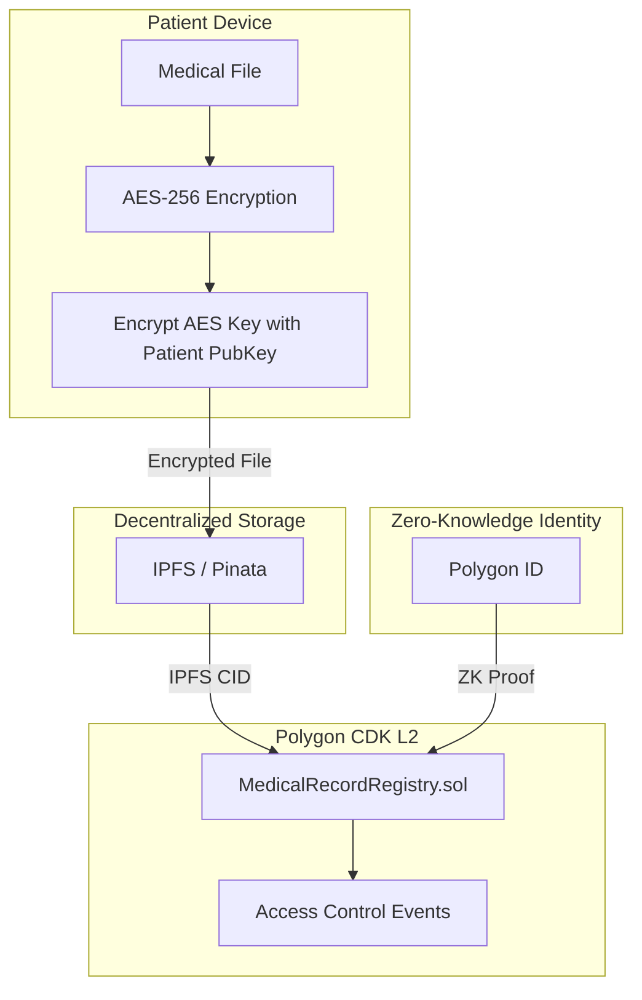
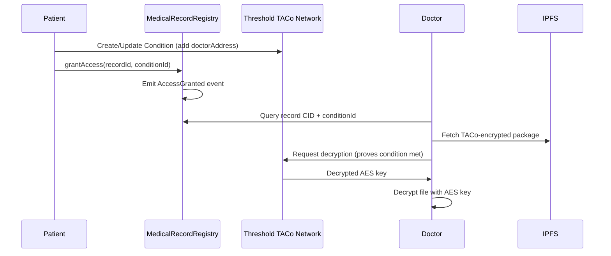
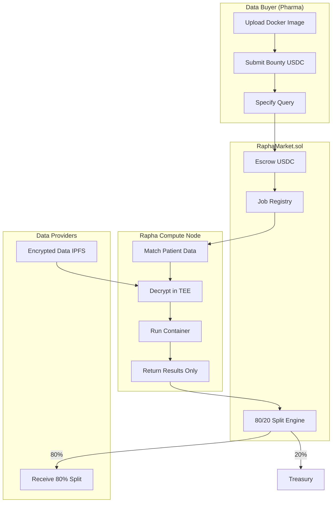

# Aura Health - Sovereign Medical Blockchain Architecture

> A privacy-first medical records system using Polygon CDK (Validium Mode), Threshold TACo (Threshold Access Control), and IPFS.

---

## 1. System Overview



---

## 2. Data Flow: Patient File Lifecycle

### Step 1: Local Encryption (Client-Side)
```
┌─────────────────────────────────────────────────────────────────┐
│  1. Generate random AES-256-GCM key                             │
│  2. Encrypt medical file → encrypted_blob                       │
│  3. Create TACo Condition (defines who can decrypt)             │
│  4. Encrypt AES key via TACo with condition attached            │
│  5. Package: { encrypted_blob, taco_ciphertext, conditionId }   │
└─────────────────────────────────────────────────────────────────┘
```

### Step 2: IPFS Upload
```
┌─────────────────────────────────────────────────────────────────┐
│  1. Upload encrypted package to IPFS (via Pinata or local node) │
│  2. Receive Content Identifier (CID): Qm...                     │
│  3. CID is immutable pointer to encrypted data                  │
└─────────────────────────────────────────────────────────────────┘
```

### Step 3: Blockchain Index Registration
```
┌─────────────────────────────────────────────────────────────────┐
│  1. Patient calls registerRecord(ipfsCID, metadata) on L2       │
│  2. Contract stores: { owner, ipfsCID, accessList, timestamp }  │
│  3. Event emitted: RecordRegistered(recordId, owner, ipfsCID)   │
│  4. Transaction batched → ZK proof → Ethereum L1 settlement     │
└─────────────────────────────────────────────────────────────────┘
```

### Access Grant Flow (TACo Conditions)


---

## 3. Smart Contract Interface

### MedicalRecordRegistry.sol

```solidity
// SPDX-License-Identifier: MIT
pragma solidity ^0.8.20;

/**
 * @title MedicalRecordRegistry
 * @notice Indexes encrypted medical records stored on IPFS with TACo access control
 * @dev Access control delegated to Threshold TACo conditions
 */
contract MedicalRecordRegistry {
    
    struct MedicalRecord {
        address owner;              // Patient wallet address
        string ipfsHash;            // IPFS CID - pointer to TACo-encrypted file
        string integrityHash;       // SHA-256 hash of original file (for audit)
        string recordType;          // e.g., "MRI", "Blood", "Genomics"
        address provider;           // Hospital/clinic that created the record
        bytes32 conditionId;        // TACo policy ID for access control
        uint256 timestamp;          // Block timestamp of registration
        bool isActive;              // Soft delete flag
    }
    
    // State
    mapping(bytes32 => MedicalRecord) public records;           // recordId => Record
    mapping(address => bytes32[]) public patientRecords;        // patient => recordIds
    mapping(address => bytes32[]) public providerRecords;       // provider => recordIds
    
    // Events
    event RecordRegistered(
        bytes32 indexed recordId, 
        address indexed owner, 
        address indexed provider,
        string ipfsHash,
        string recordType
    );
    event ConditionUpdated(bytes32 indexed recordId, bytes32 oldConditionId, bytes32 newConditionId);
    event RecordDeactivated(bytes32 indexed recordId);
    
    // Modifiers
    modifier onlyRecordOwner(bytes32 recordId) {
        require(records[recordId].owner == msg.sender, "Not record owner");
        _;
    }
    
    modifier onlyPatientOrProvider(bytes32 recordId) {
        MedicalRecord storage record = records[recordId];
        require(
            record.owner == msg.sender || record.provider == msg.sender,
            "Not patient or provider"
        );
        _;
    }
    
    // Core Functions
    function registerRecord(
        string calldata ipfsHash,
        string calldata integrityHash,
        string calldata recordType,
        address provider,
        bytes32 conditionId
    ) external returns (bytes32 recordId);
    
    function updateCondition(
        bytes32 recordId,
        bytes32 newConditionId  // New TACo policy after granting/revoking access
    ) external onlyRecordOwner(recordId);
    
    function deactivateRecord(
        bytes32 recordId
    ) external onlyRecordOwner(recordId);
    
    function getRecord(bytes32 recordId) 
        external view 
        returns (MedicalRecord memory);
    
    function getPatientRecords(address patient)
        external view
        returns (bytes32[] memory);
    
    function getRecordsByType(address patient, string calldata recordType)
        external view
        returns (bytes32[] memory);
}
```

> [!NOTE]
> **TACo Integration**: Access control is managed off-chain via TACo conditions. The `conditionId` links to the Threshold Network policy. When granting access, the patient updates the TACo condition and then calls `updateCondition()` to record the new policy on-chain.

---

## 4. Directory Structure (Monorepo)

```
aura-health/
├── .github/
│   └── workflows/
│       ├── contracts-ci.yml        # Foundry test + deploy
│       └── backend-ci.yml          # TypeScript linting + tests
│
├── contracts/                       # Solidity Smart Contracts
│   ├── foundry.toml                 # Foundry configuration
│   ├── src/
│   │   ├── MedicalRecordRegistry.sol
│   │   ├── interfaces/
│   │   │   └── IMedicalRecordRegistry.sol
│   │   └── libraries/
│   │       └── AccessControl.sol
│   ├── test/
│   │   └── MedicalRecordRegistry.t.sol
│   └── script/
│       └── Deploy.s.sol
│
├── cdk-node/                        # Polygon CDK Configuration (Mock Prover)
│   ├── docker-compose.yml           # Local ZK-Rollup devnet
│   ├── config/
│   │   ├── node-config.toml         # CDK node settings (mockMode=true)
│   │   ├── genesis.json             # Chain genesis
│   │   └── prover-config.json       # Mock prover settings (~16GB RAM)
│   └── scripts/
│       ├── start-devnet.sh
│       └── stop-devnet.sh
│
├── backend-oracle/                  # TypeScript Backend SDK
│   ├── package.json
│   ├── tsconfig.json
│   ├── src/
│   │   ├── index.ts                 # Main exports
│   │   ├── crypto/
│   │   │   ├── aes.service.ts       # AES-256-GCM encryption
│   │   │   ├── taco.service.ts      # @nucypher/taco-sdk integration
│   │   │   └── keys.service.ts      # Key generation/management
│   │   ├── storage/
│   │   │   └── ipfs.service.ts      # IPFS/Pinata client
│   │   ├── chain/
│   │   │   ├── registry.service.ts  # Contract interactions
│   │   │   └── provider.ts          # ethers.js provider setup
│   │   └── types/
│   │       └── index.ts             # TypeScript interfaces
│   └── tests/
│       ├── crypto.test.ts
│       └── integration.test.ts
│
├── frontend-app/                    # React + Vite Frontend
│   ├── package.json
│   ├── vite.config.ts
│   ├── tailwind.config.js
│   ├── index.html
│   ├── src/
│   │   ├── main.tsx
│   │   ├── App.tsx
│   │   ├── components/
│   │   │   ├── upload/
│   │   │   │   └── FileUploader.tsx
│   │   │   ├── records/
│   │   │   │   └── RecordList.tsx
│   │   │   └── access/
│   │   │       └── AccessManager.tsx
│   │   ├── hooks/
│   │   │   ├── useWallet.ts
│   │   │   └── useRecords.ts
│   │   ├── services/
│   │   │   └── aura-sdk.ts          # Wraps backend-oracle
│   │   └── styles/
│   │       └── globals.css
│   └── public/
│       └── assets/
│
├── docs/
│   └── API.md
│
├── package.json                     # Monorepo root (workspaces)
├── turbo.json                       # Turborepo config (optional)
└── README.md
```

---

## 5. Technology Stack Summary

| Layer | Technology | Purpose |
|-------|------------|---------|
| **L1 Settlement** | Ethereum Mainnet | Final transaction settlement |
| **L2 Execution** | Polygon CDK (Validium) | Low-cost transactions, ZK proofs |
| **Smart Contracts** | Solidity + Foundry | Record registry, TACo condition linking |
| **Identity** | Polygon ID | Zero-knowledge identity proofs |
| **Encryption** | AES-256-GCM + TACo | Symmetric encryption + threshold access control |
| **Storage** | IPFS (Pinata) | Decentralized encrypted file storage |
| **Backend** | TypeScript + Node.js | SDK, encryption services |
| **Frontend** | React + Vite + Tailwind | Patient/Provider dashboard |

---

## 6. Security Considerations

> [!IMPORTANT]
> - **Client-side encryption**: Files are NEVER transmitted unencrypted
> - **TACo conditions**: Access policies define WHO can decrypt, enforced by Threshold Network
> - **No plaintext on-chain**: Only CIDs, hashes, and conditionIds stored in contract
> - **Condition-based sharing**: Patients update TACo conditions to grant/revoke access dynamically

> [!CAUTION]
> **Mock Prover Mode**: Local devnet uses `zkevm.prover.mockMode = true` due to 16GB RAM constraint. Production deployment requires full prover (32GB+ RAM).

---

## 7. Next Steps (Agent Orchestration)

Upon approval, three parallel agents will scaffold:

| Agent | Responsibility | Key Deliverables |
|-------|----------------|------------------|
| **Chain Smith** | Polygon CDK devnet (Mock Prover) | `docker-compose.yml`, `node-config.toml` with mockMode, startup scripts |
| **Cryptographer** | TACo encryption service | `aes.service.ts`, `taco.service.ts` (@nucypher/taco-sdk) |
| **Solidity Engineer** | Smart contracts | `MedicalRecordRegistry.sol` with TACo conditionId, tests, deploy scripts |

---

## 8. Rapha DeSci Protocol Extension

The DeSci (Decentralized Science) layer enables a **Compute-to-Data** marketplace where pharmaceutical companies train AI models on encrypted patient data without accessing raw data.

### Architecture Overview



### The Three Pillars

| Pillar | Component | Purpose |
|--------|-----------|---------|
| **1. Blind Compute** | `rapha-compute-node.ts` | TEE-based computation, Docker sandboxing |
| **2. Marketplace dApp** | `CreateComputeJob.tsx`, `PharmaDashboard.tsx` | Pharma job submission UI |
| **3. Treasury Contract** | `RaphaMarket.sol` | USDC escrow, 80/20 revenue split |

### Revenue Model (The "DeSci Tax")

```
Total Bounty: 50,000 USDC
├── 20% Platform Fee → RaphaCompanyWallet (10,000 USDC)
└── 80% Patient Rewards → PatientStakingPool (40,000 USDC)
    └── Pro-rated to N patients whose data matched query
```

### Key Files

| File | Location | Description |
|------|----------|-------------|
| `RaphaMarket.sol` | `contracts/src/` | Marketplace contract with escrow |
| `IRaphaMarket.sol` | `contracts/src/interfaces/` | Contract interface |
| `rapha-compute-node.ts` | `backend-oracle/src/compute/` | Compute node pseudocode |
| `CreateComputeJob.tsx` | `frontend-app/src/components/marketplace/` | Job submission form |
| `PharmaDashboard.tsx` | `frontend-app/src/components/marketplace/` | Pharma dashboard |

> [!NOTE]
> **Privacy Guarantee**: Raw patient data never leaves the Compute Node's TEE. Only computed insights (model weights) are returned to the pharmaceutical company.

